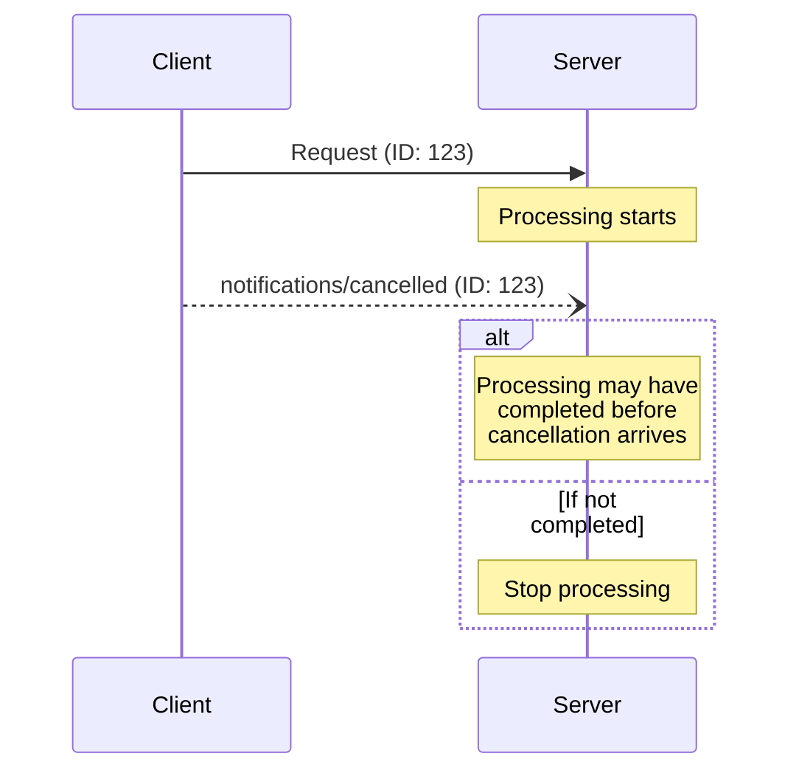

<div id="enable-section-numbers" />

<Info>**Protocol Revision**: draft</Info>

The Model Context Protocol (MCP) supports optional cancellation of in-progress requests
through notification messages. Either side can send a cancellation notification to
indicate that a previously-issued request should be terminated.

## Cancellation Flow

When a party wants to cancel an in-progress request, it sends a `notifications/cancelled`
notification containing:

- For non-task requests: The ID of the request to cancel
- For task cancellation: The ID of the task to cancel
- An optional reason string that can be logged or displayed

### Cancelling Non-Task Requests

```json
{
  "jsonrpc": "2.0",
  "method": "notifications/cancelled",
  "params": {
    "requestId": "123",
    "reason": "User requested cancellation"
  }
}
```

### Cancelling Tasks

For task-augmented requests, once the `CreateTaskResult` is returned, the original request is complete and `requestId` becomes ambiguous. Therefore, task cancellation **MUST** use `taskId`:

```json
{
  "jsonrpc": "2.0",
  "method": "notifications/cancelled",
  "params": {
    "taskId": "786512e2-9e0d-44bd-8f29-789f320fe840",
    "reason": "User requested cancellation"
  }
}
```

## Behavior Requirements

### General Requirements

1. Cancellation notifications **MUST** only reference requests or tasks that:
   - Were previously issued in the same direction
   - Are believed to still be in-progress
2. The `initialize` request **MUST NOT** be cancelled by clients
3. Receivers of cancellation notifications **SHOULD**:
   - Stop processing the cancelled request or task
   - Free associated resources
   - For non-task requests: Not send a response for the cancelled request
   - For tasks: Move the task to `cancelled` status
4. Receivers **MAY** ignore cancellation notifications if:
   - The referenced request or task is unknown
   - Processing has already completed (for non-task requests) or reached a terminal status (for tasks)
   - The request or task cannot be cancelled
5. The sender of the cancellation notification **SHOULD** ignore any response to the
   request that arrives afterward

### Task-Specific Requirements

1. For task cancellation, `taskId` **MUST** be provided (not `requestId`)
2. `requestId` **MUST NOT** be used for task cancellation once `CreateTaskResult` has been returned
3. When a receiver receives a `notifications/cancelled` notification with a `taskId`, it **SHOULD** immediately move the task to `cancelled` status
4. If a cancellation notification arrives after a task has already reached a terminal status (`completed`, `failed`, or `cancelled`), receivers **SHOULD** ignore the notification
5. Requestors **SHOULD** poll with `tasks/get` after sending a cancellation notification to confirm the task has transitioned to `cancelled` status

## Timing Considerations

Due to network latency, cancellation notifications may arrive after request processing
has completed, and potentially after a response has already been sent.

Both parties **MUST** handle these race conditions gracefully:



## Implementation Notes

- Both parties **SHOULD** log cancellation reasons for debugging
- Application UIs **SHOULD** indicate when cancellation is requested

## Error Handling

Invalid cancellation notifications **SHOULD** be ignored:

- Unknown request IDs or task IDs
- Already completed requests or tasks in terminal status
- Malformed notifications
- Using `requestId` for task cancellation (should use `taskId` instead)

This maintains the "fire and forget" nature of notifications while allowing for race
conditions in asynchronous communication.
