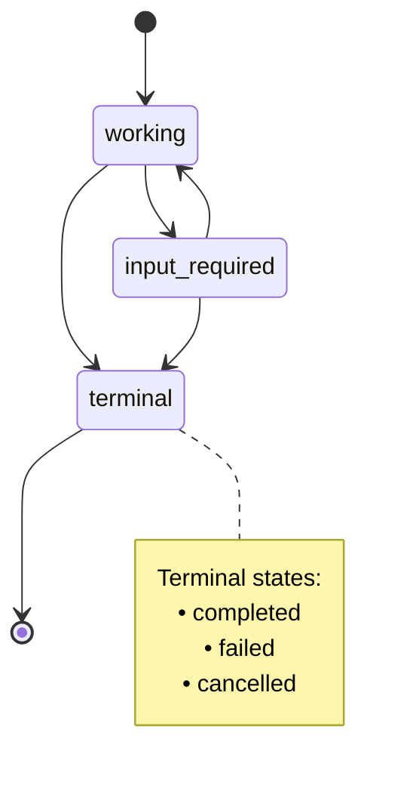
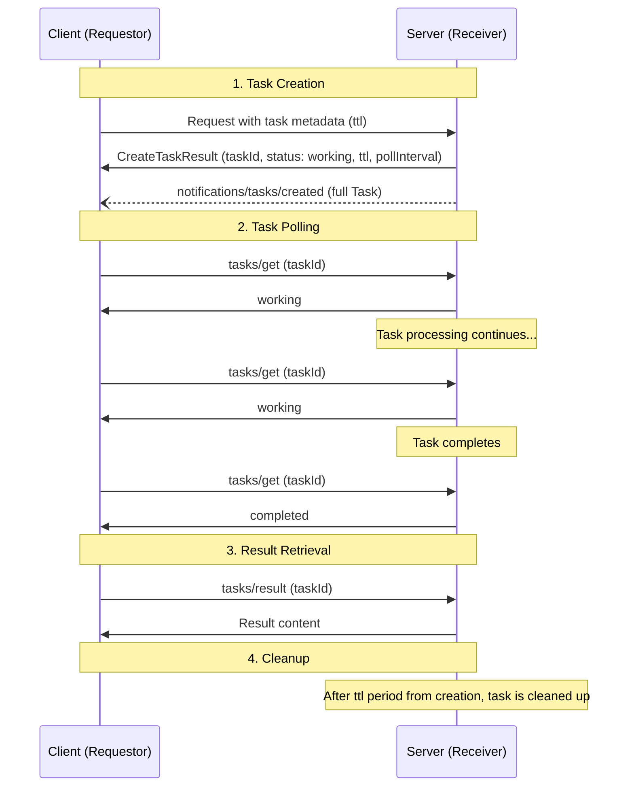
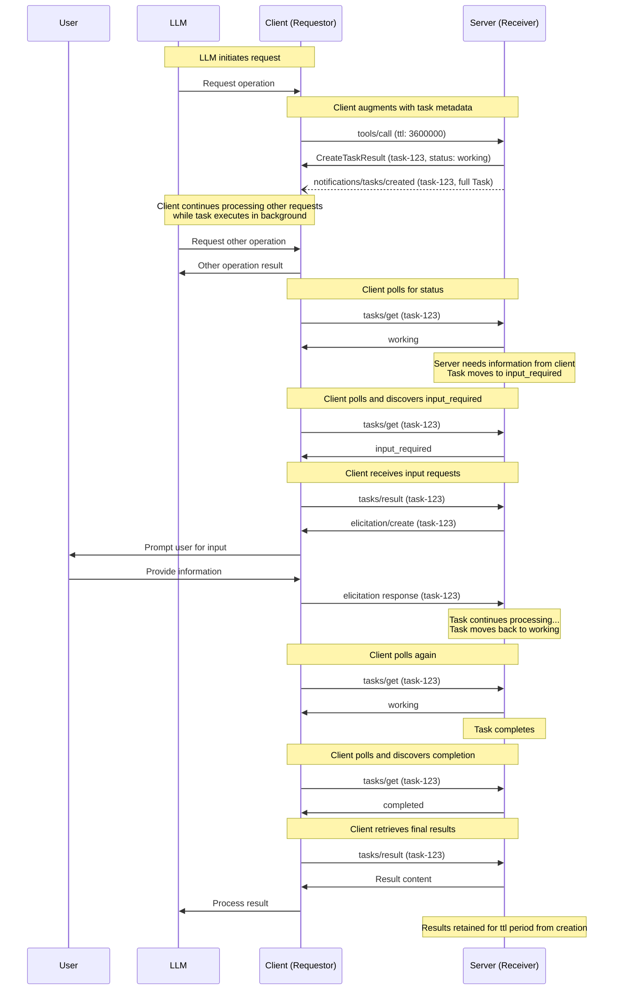
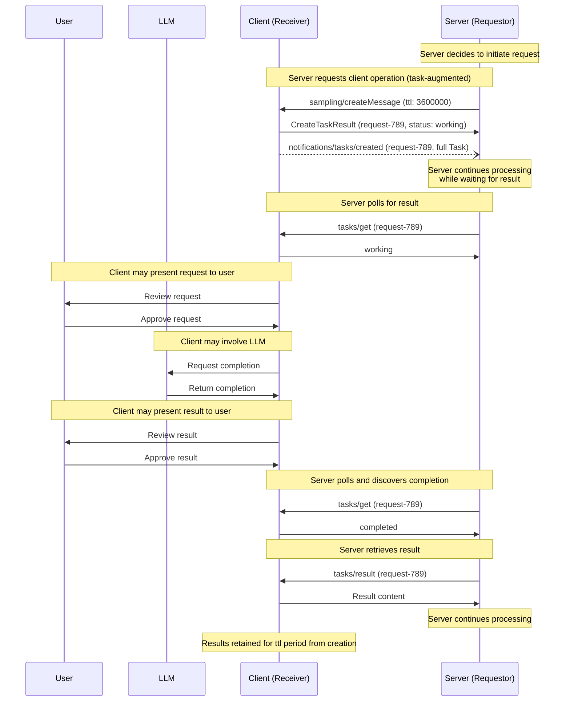
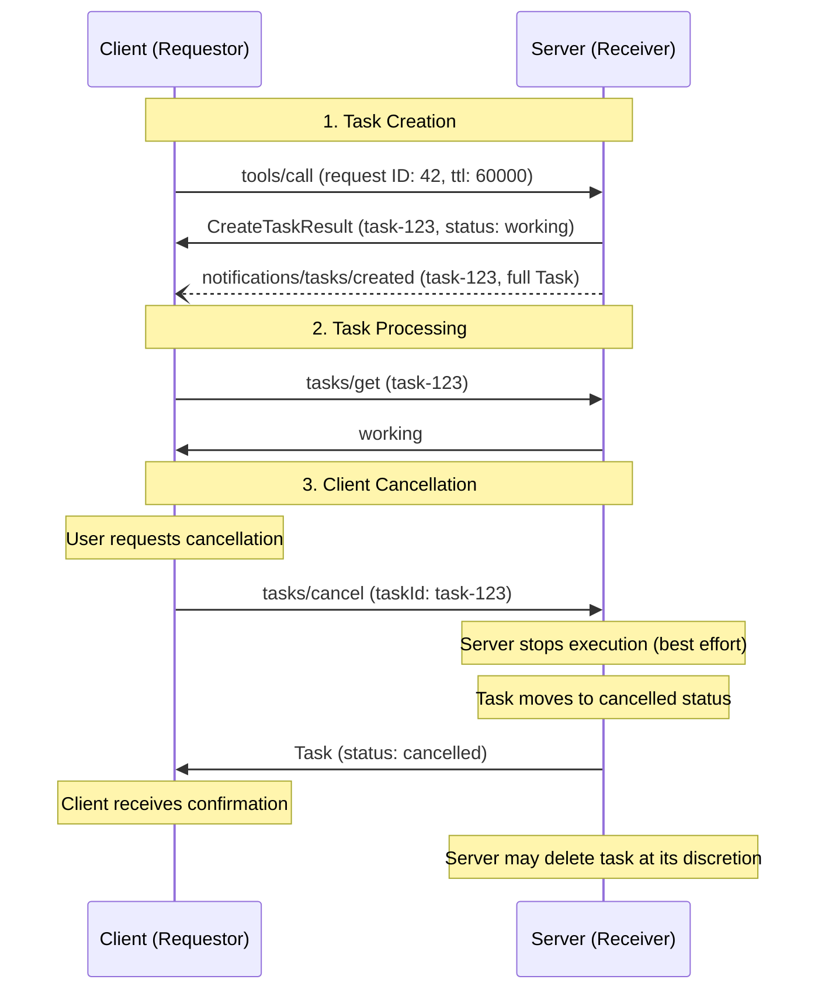

<div id="enable-section-numbers" />

<Info>**Protocol Revision**: draft</Info>

<Note>

Tasks are newly-introduced in this version of the MCP specification and are currently considered **experimental**.
The design of tasks may evolve in future protocol versions.

</Note>

The Model Context Protcol (MCP) allows requestors (which can be either clients or servers, depending on the direction of communication) to augment their requests with **tasks**. Tasks are durable state machines that carry information about the underlying execution state of the request they wrap, and are intended for requestor polling and deferred result retrieval. Each task is uniquely identifiable by a receiver-generated **task ID**.

## User Interaction Model

Tasks are designed to be **application-driven**—receivers tightly-control which requests (if any) support task-based execution and manage the lifecycles of those tasks; meanwhile, requestors own the responsibility for augmenting requests with tasks, and for polling on the results of those tasks.

Implementations are free to expose tasks through any interface pattern that suits their needs—the protocol itself does not mandate any specific user interaction model.

## Capabilities

Servers and clients that support task-augmented requests **MUST** declare a `tasks` capability during initialization. The `tasks` capability is structured by request category, with boolean properties indicating which specific request types support task augmentation.

### Server Capabilities

Servers declare if they support tasks, and if so, which server-side requests can be augmented with tasks:

```json
{
  "capabilities": {
    "tasks": {
      "list": {},
      "cancel": {},
      "requests": {
        "tools": {
          "call": {}
        }
      }
    }
  }
}
```

### Client Capabilities

Clients declare if they support tasks, and if so, which client-side requests can be augmented with tasks:

```json
{
  "capabilities": {
    "tasks": {
      "list": {},
      "cancel": {},
      "requests": {
        "sampling": {
          "createMessage": {}
        },
        "elicitation": {
          "create": {}
        }
      }
    }
  }
}
```

### Capability Negotiation

During the initialization phase, both parties exchange their `tasks` capabilities to establish which operations support task-based execution. Requestors **MUST** only augment requests with task metadata if the corresponding capability has been declared by the receiver.

For example, if a server's capabilities include `tasks.requests.tools.call: true`, then clients may augment `tools/call` requests with task metadata. If a client's capabilities include `tasks.requests.sampling.createMessage: true`, then servers may augment `sampling/createMessage` requests with task metadata.

If `capabilities.tasks` is not defined, the peer **MUST NOT** attempt to create tasks during requests.

The set of capabilities in `capabilities.tasks.requests` is exhaustive. If a request type is not present, it does not support task-augmentation.

`capabilities.tasks.list` controls if the `tasks/list` operation is supported by the party.

`capabilities.tasks.cancel` controls if the `tasks/cancel` operation is supported by the party.

### Tool-Level Negotiation

Tool calls are given special consideration for the purpose of task augmentation. In the result of `tools/list`, tools declare support for tasks via `annotations.taskHint`.

This is to be interpreted as a fine-grained layer in addition to capabilities. If a server's capabilities include `tasks.requests.tools.call: false`, then clients **MUST NOT** attempt to use task augmentation on that server's tools, even if they declare tool-level support via `annotations.taskHint`.

## Protocol Messages

### Creating Tasks

Task-augmented requests follow a two-phase response pattern that differs from normal requests:

- **Normal requests**: The server processes the request and returns the actual operation result directly.
- **Task-augmented requests**: The server accepts the request and immediately returns a `CreateTaskResult` containing task metadata. The actual operation result becomes available later through `tasks/result` after the task completes.

To create a task, requestors send a request with the `modelcontextprotocol.io/task` key included in `_meta`. Requestors **MAY** include a `ttl` value representing how long from task creation the requestor would like the task to be retained for.

**Request:**

```json
{
  "jsonrpc": "2.0",
  "id": 1,
  "method": "tools/call",
  "params": {
    "name": "get_weather",
    "arguments": {
      "city": "New York"
    },
    "_meta": {
      "modelcontextprotocol.io/task": {
        "ttl": 60000
      }
    }
  }
}
```

**Response:**

```json
{
  "jsonrpc": "2.0",
  "id": 1,
  "result": {
    "taskId": "786512e2-9e0d-44bd-8f29-789f320fe840",
    "status": "working",
    "statusMessage": "The operation is now in progress.",
    "createdAt": "2025-11-25T10:30:00Z",
    "ttl": 60000,
    "pollInterval": 5000,
    "_meta": {
      "modelcontextprotocol.io/related-task": {
        "taskId": "786512e2-9e0d-44bd-8f29-789f320fe840"
      }
    }
  }
}
```

When a receiver accepts a task-augmented request, it returns a `CreateTaskResult` containing task metadata. This response does not include the actual operation result. The actual result (e.g., tool result for `tools/call`) becomes available only through `tasks/result` after the task completes.

### Getting Tasks

To retrieve the state of a task, requestors send a `tasks/get` request:

**Request:**

```json
{
  "jsonrpc": "2.0",
  "id": 3,
  "method": "tasks/get",
  "params": {
    "taskId": "786512e2-9e0d-44bd-8f29-789f320fe840"
  }
}
```

**Response:**

```json
{
  "jsonrpc": "2.0",
  "id": 3,
  "result": {
    "taskId": "786512e2-9e0d-44bd-8f29-789f320fe840",
    "status": "working",
    "statusMessage": "The operation is now in progress.",
    "createdAt": "2025-11-25T10:30:00Z",
    "ttl": 30000,
    "pollInterval": 5000,
    "_meta": {
      "modelcontextprotocol.io/related-task": {
        "taskId": "786512e2-9e0d-44bd-8f29-789f320fe840"
      }
    }
  }
}
```

### Retrieving Task Results

After a task completes, the actual operation result is retrieved via `tasks/result`. This is distinct from the initial `CreateTaskResult` response, which contains only task metadata. The result structure matches the original request type (e.g., `CallToolResult` for `tools/call`).

To retrieve the result of a completed task, requestors send a `tasks/result` request:

**Request:**

```json
{
  "jsonrpc": "2.0",
  "id": 4,
  "method": "tasks/result",
  "params": {
    "taskId": "786512e2-9e0d-44bd-8f29-789f320fe840"
  }
}
```

**Response:**

```json
{
  "jsonrpc": "2.0",
  "id": 4,
  "result": {
    "content": [
      {
        "type": "text",
        "text": "Current weather in New York:\nTemperature: 72°F\nConditions: Partly cloudy"
      }
    ],
    "isError": false,
    "_meta": {
      "modelcontextprotocol.io/related-task": {
        "taskId": "786512e2-9e0d-44bd-8f29-789f320fe840"
      }
    }
  }
}
```

### Task Creation Notification

When a receiver creates a task, it **MAY** send a `notifications/tasks/created` notification to inform the requestor that the task has been created and polling can begin. This notification includes the full task state.

**Notification:**

```json
{
  "jsonrpc": "2.0",
  "method": "notifications/tasks/created",
  "params": {
    "taskId": "786512e2-9e0d-44bd-8f29-789f320fe840",
    "status": "working",
    "statusMessage": "The operation is now in progress.",
    "createdAt": "2025-11-25T10:30:00Z",
    "ttl": 60000,
    "pollInterval": 5000,
    "_meta": {
      "modelcontextprotocol.io/related-task": {
        "taskId": "786512e2-9e0d-44bd-8f29-789f320fe840"
      }
    }
  }
}
```

The notification includes the full `Task` object with all task metadata fields, allowing requestors to immediately access the task state without making an additional `tasks/get` request.

Requestors **MUST NOT** rely on receiving this notification. Requestors **SHOULD** be prepared to begin polling via `tasks/get` immediately after receiving the `CreateTaskResult` response, regardless of whether this notification is received.

### Task Status Notification

When a task's status changes, receivers **MAY** send a `notifications/tasks/status` notification to inform the requestor of the change. This notification includes the full task state.

**Notification:**

```json
{
  "jsonrpc": "2.0",
  "method": "notifications/tasks/status",
  "params": {
    "taskId": "786512e2-9e0d-44bd-8f29-789f320fe840",
    "status": "completed",
    "createdAt": "2025-11-25T10:30:00Z",
    "ttl": 60000,
    "pollInterval": 5000,
    "_meta": {
      "modelcontextprotocol.io/related-task": {
        "taskId": "786512e2-9e0d-44bd-8f29-789f320fe840"
      }
    }
  }
}
```

The notification includes the full `Task` object with all task metadata fields, including the updated `status`, `statusMessage` (if present), and `error` (if the status is `failed`). This allows requestors to access the complete task state without making an additional `tasks/get` request.

Requestors **MUST NOT** rely on receiving these notifications, as they are optional. Receivers are not required to send status notifications and may choose to only send them for certain status transitions. Requestors **SHOULD** continue to poll via `tasks/get` to ensure they receive status updates.

### Listing Tasks

To retrieve a list of tasks, requestors send a `tasks/list` request. This operation supports pagination.

**Request:**

```json
{
  "jsonrpc": "2.0",
  "id": 5,
  "method": "tasks/list",
  "params": {
    "cursor": "optional-cursor-value"
  }
}
```

**Response:**

```json
{
  "jsonrpc": "2.0",
  "id": 5,
  "result": {
    "tasks": [
      {
        "taskId": "786512e2-9e0d-44bd-8f29-789f320fe840",
        "status": "working",
        "createdAt": "2025-11-25T10:30:00Z",
        "ttl": 30000,
        "pollInterval": 5000
      },
      {
        "taskId": "abc123-def456-ghi789",
        "status": "completed",
        "createdAt": "2025-11-25T09:15:00Z",
        "ttl": 60000
      }
    ],
    "nextCursor": "next-page-cursor"
  }
}
```

### Cancelling Tasks

To explicitly cancel a task, requestors send a `tasks/cancel` request.

**Request:**

```json
{
  "jsonrpc": "2.0",
  "id": 6,
  "method": "tasks/cancel",
  "params": {
    "taskId": "786512e2-9e0d-44bd-8f29-789f320fe840"
  }
}
```

**Response:**

```json
{
  "jsonrpc": "2.0",
  "id": 6,
  "result": {
    "taskId": "786512e2-9e0d-44bd-8f29-789f320fe840",
    "status": "cancelled",
    "statusMessage": "The task was cancelled by request.",
    "createdAt": "2025-11-25T10:30:00Z",
    "ttl": 30000,
    "pollInterval": 5000,
    "_meta": {
      "modelcontextprotocol.io/related-task": {
        "taskId": "786512e2-9e0d-44bd-8f29-789f320fe840"
      }
    }
  }
}
```

## Behavior Requirements

These requirements apply to all parties that support receiving task-augmented requests.

### Task Support and Handling

1. Receivers that do not declare the task capability for a request type **MUST** process requests of that type normally, ignoring any task-augmentation metadata if present.
1. Receivers that do declare the task capability for a request type **MAY** return an error for non-task-augmented requests of that type, requiring requestors to use task augmentation.

### Task ID Requirements

1. Task IDs **MUST** be a string value.
1. Task IDs **MUST** be generated by the receiver when creating a task.
1. Task IDs **MUST** be unique across all tasks controlled by the receiver.

### Task Status Lifecycle

1. Tasks **MUST** begin in the `working` status when created.
1. Receivers **MUST** only transition tasks through the following valid paths:
   1. From `working`: may move to `input_required`, `completed`, `failed`, or `cancelled`
   1. From `input_required`: may move to `working`, `completed`, `failed`, or `cancelled`
   1. Tasks in `completed`, `failed`, or `cancelled` status **MUST NOT** transition to any other status (terminal states)

**Task Status State Diagram:**



### Input Required Status

1. When the task receiver has messages for the requestor that are necessary to complete the task, the receiver **SHOULD** move the task to the `input_required` status.
1. The receiver **MUST** include the `modelcontextprotocol.io/related-task` metadata in the request to associate it with the task.
1. When the requestor encounters the `input_required` status, it **SHOULD** call `tasks/result` prematurely.
1. When the receiver receives all required input, the task **SHOULD** transition out of `input_required` status (typically back to `working`).

### TTL and Resource Management

1. Receivers **MUST** include a `createdAt` timestamp (ISO 8601 format) in all task responses to indicate when the task was created.
1. Receivers **MAY** override the requested `ttl` duration.
1. Receivers **MUST** include the actual `ttl` duration (or `null` for unlimited) in `tasks/get` responses.
1. After a task's `ttl` duration has elapsed from creation, receivers **MAY** delete the task and its results, regardless of the task's status.
1. Receivers **MAY** include a `pollInterval` value (in milliseconds) in `tasks/get` responses to suggest polling intervals. Requestors **SHOULD** respect this value when provided.

### Result Retrieval

1. Receivers that accept a task-augmented request **MUST** return a `CreateTaskResult` as the response. This result **SHOULD** be returned as soon as possible after accepting the task.
1. When a receiver receives a `tasks/result` request for a task in a terminal status (`completed`, `failed`, or `cancelled`), it **MUST** return the final result of the underlying request, whether that is a successful result or a JSON-RPC error.
1. When a receiver receives a `tasks/result` request for a task in any other non-terminal status (`working` or `input_required`), it **MUST** block the response until the task reaches a terminal status.
1. For tasks in a terminal status, receivers **MUST** return from `tasks/result` exactly what the underlying request would have returned, whether that is a successful result or a JSON-RPC error.

### Associating Task-Related Messages

1. All requests, notifications, and responses related to a task **MUST** include the `modelcontextprotocol.io/related-task` key in their `_meta`, with the value set to an object with a `taskId` matching the associated task ID.
1. For example, an elicitation that a task-augmented tool call depends on **MUST** share the same related task ID with that tool call's task.
1. For the `tasks/get`, `tasks/list`, `tasks/result`, and `tasks/cancel` operations, the `taskId` parameter in the request **MUST** be used as the source of truth for identifying the target task. Requestors **SHOULD NOT** include `modelcontextprotocol.io/related-task` metadata in these requests, and receivers **MUST** ignore such metadata if present in favor of the RPC method parameter.

### Task Notifications

1. Receivers **MAY** send a `notifications/tasks/created` notification after creating a task to inform the requestor that the task is ready for polling.
1. Receivers **MAY** send `notifications/tasks/status` notifications when a task's status changes.
1. Requestors **MUST NOT** rely on receiving either notification type, as they are both optional.
1. When sent, these notifications **MUST** include the `modelcontextprotocol.io/related-task` metadata as described in "Associating Task-Related Messages".

### Task Progress Notifications

Task-augmented requests support progress notifications as defined in the [progress](./progress) specification. The `progressToken` provided in the initial request remains valid throughout the task's lifetime.

### Task Listing

1. Receivers **SHOULD** use cursor-based pagination to limit the number of tasks returned in a single response.
1. Receivers **MUST** include a `nextCursor` in the response if more tasks are available.
1. Requestors **MUST** treat cursors as opaque tokens and not attempt to parse or modify them.
1. If a task is retrievable via `tasks/get` for a requestor, it **MUST** be retrievable via `tasks/list` for that requestor.

### Task Cancellation

1. Receivers **MUST** reject cancellation requests for tasks already in a terminal status (`completed`, `failed`, or `cancelled`) with error code `-32602` (Invalid params).
1. Upon receiving a valid cancellation request, receivers **SHOULD** attempt to stop the task's execution (best effort) and **MUST** transition the task to `cancelled` status before sending the response.
1. Once a task is cancelled, it **MUST** remain in `cancelled` status even if execution continues to completion or fails.
1. The `tasks/cancel` operation does not define deletion behavior. However, receivers **MAY** delete cancelled tasks at their discretion at any time, including immediately after cancellation or after the task's `ttl` expires.
1. Requestors **SHOULD NOT** rely on cancelled tasks being retained for any specific duration and should retrieve any needed information before cancelling.

## Message Flow

### Basic Task Lifecycle



### Task-Augmented Tool Call With Elicitation



### Task-Augmented Sampling Request



### Task Cancellation Flow



## Data Types

### Task

A task represents the execution state of a request. The task metadata includes:

- `taskId`: Unique identifier for the task
- `status`: Current state of the task execution
- `createdAt`: ISO 8601 timestamp when the task was created
- `ttl`: Time in milliseconds from creation before task may be deleted
- `pollInterval`: Suggested time in milliseconds between status checks

### Task Status

Tasks can be in one of the following states:

- `working`: The request is currently being processed
- `input_required`: The receiver needs input from the requestor. The requestor should call `tasks/result` to receive input requests, even though the task has not reached a terminal state.
- `completed`: The request completed successfully and results are available
- `failed`: The associated request did not complete successfully. For tool calls specifically, this includes cases where the tool call result has `isError` set to true.
- `cancelled`: The request was cancelled before completion

### Task Metadata

When augmenting a request with task execution, the `modelcontextprotocol.io/task` key is included in `_meta`:

```json
{
  "modelcontextprotocol.io/task": {
    "ttl": 60000
  }
}
```

Fields:

- `ttl` (number, optional): Requested duration in milliseconds to retain task from creation

### Related Task Metadata

All requests, responses, and notifications associated with a task **MUST** include the `modelcontextprotocol.io/related-task` key in `_meta`:

```json
{
  "modelcontextprotocol.io/related-task": {
    "taskId": "786512e2-9e0d-44bd-8f29-789f320fe840"
  }
}
```

This associates messages with their originating task across the entire request lifecycle.

## Error Handling

Tasks use two error reporting mechanisms:

1. **Protocol Errors**: Standard JSON-RPC errors for protocol-level issues
1. **Task Execution Errors**: Errors in the underlying request execution, reported through task status

### Protocol Errors

Receivers **MUST** return standard JSON-RPC errors for the following protocol error cases:

- Invalid or nonexistent `taskId` in `tasks/get`, `tasks/list`, `tasks/result`, or `tasks/cancel`: `-32602` (Invalid params)
- Invalid or nonexistent cursor in `tasks/list`: `-32602` (Invalid params)
- Attempt to cancel a task already in a terminal status: `-32602` (Invalid params)
- Internal errors: `-32603` (Internal error)

Additionally, receivers **MAY** return the following errors:

- Non-task-augmented request when receiver requires task augmentation for that request type: `-32600` (Invalid request)

Receivers **SHOULD** provide informative error messages to describe the cause of errors.

**Example: Task augmentation required**

```json
{
  "jsonrpc": "2.0",
  "id": 1,
  "error": {
    "code": -32600,
    "message": "Task augmentation required for tools/call requests"
  }
}
```

**Example: Task not found**

```json
{
  "jsonrpc": "2.0",
  "id": 70,
  "error": {
    "code": -32602,
    "message": "Failed to retrieve task: Task not found"
  }
}
```

**Example: Task expired**

```json
{
  "jsonrpc": "2.0",
  "id": 71,
  "error": {
    "code": -32602,
    "message": "Failed to retrieve task: Task has expired"
  }
}
```

<Note>

Receivers are not obligated to retain task metadata indefinitely. It is compliant behavior for a receiver to return a "not-found" error if it has purged an expired task.

</Note>

**Example: Task cancellation rejected (already terminal)**

```json
{
  "jsonrpc": "2.0",
  "id": 74,
  "error": {
    "code": -32602,
    "message": "Cannot cancel task: already in terminal status 'completed'"
  }
}
```

### Task Execution Errors

When the underlying request does not complete successfully, the task moves to the `failed` status. This includes JSON-RPC protocol errors during request execution, or for tool calls specifically, when the tool result has `isError` set to true. The `tasks/get` response **SHOULD** include an `error` field with details about the failure.

**Example: Task with execution error**

```json
{
  "jsonrpc": "2.0",
  "id": 4,
  "result": {
    "taskId": "786512e2-9e0d-44bd-8f29-789f820fe840",
    "status": "failed",
    "createdAt": "2025-11-25T10:30:00Z",
    "ttl": 30000,
    "error": "Tool execution failed: API rate limit exceeded"
  }
}
```

For tasks that wrap tool call requests, when the tool result has `isError` set to true, the task should reach `failed` status.

The `tasks/result` endpoint returns exactly what the underlying request would have returned:

- If the underlying request resulted in a JSON-RPC error, `tasks/result` **MUST** return that same JSON-RPC error.
- If the request completed with a JSON-RPC response, `tasks/result` **MUST** return a successful JSON-RPC response containing that result.

## Security Considerations

### Task Isolation and Access Control

Task IDs are the primary mechanism for accessing task state and results. Without proper access controls, any party that can guess or obtain a task ID could potentially access sensitive information or manipulate tasks they did not create. To prevent unauthorized access, receivers **SHOULD** bind tasks to the session or authentication context that created them.

However, context-binding is not practical for all applications. Some MCP servers operate in environments without session management (such as single-user tools), or use transports that don't support sessions or authentication.
In these cases, receivers **SHOULD** document this limitation clearly, as task results may be accessible to any requestor that can guess the task ID.
When context-binding is not available, receivers **SHOULD** use cryptographically random task IDs with sufficient entropy to make guessing infeasible, and consider implementing shorter TTL durations to limit exposure windows.

If context-binding is supported, for `tasks/get`, `tasks/result`, and `tasks/cancel` requests, receivers **MUST** reject requests for tasks from different sessions or authentication contexts. For `tasks/list` requests, receivers **MUST** filter the returned task list to only include tasks belonging to the requestor's session or authentication context.

Additionally, receivers **SHOULD** implement rate limiting on task operations to prevent denial-of-service and enumeration attacks.

### Resource Management

1. Receivers **SHOULD**:
   1. Enforce limits on concurrent tasks per requestor
   1. Enforce maximum `ttl` durations to prevent indefinite resource retention
   1. Clean up expired tasks promptly to free resources
1. Receivers **SHOULD**:
   1. Document maximum supported `ttl` duration
   1. Document maximum concurrent tasks per requestor
   1. Implement monitoring and alerting for resource usage

### Audit and Logging

1. Receivers **SHOULD**:
   1. Log task creation, completion, and retrieval events for audit purposes
   1. Include session/auth context in logs when available
   1. Monitor for suspicious patterns (e.g., many failed task lookups, excessive polling)
1. Requestors **SHOULD**:
   1. Log task lifecycle events for debugging and audit purposes
   1. Track task IDs and their associated operations
