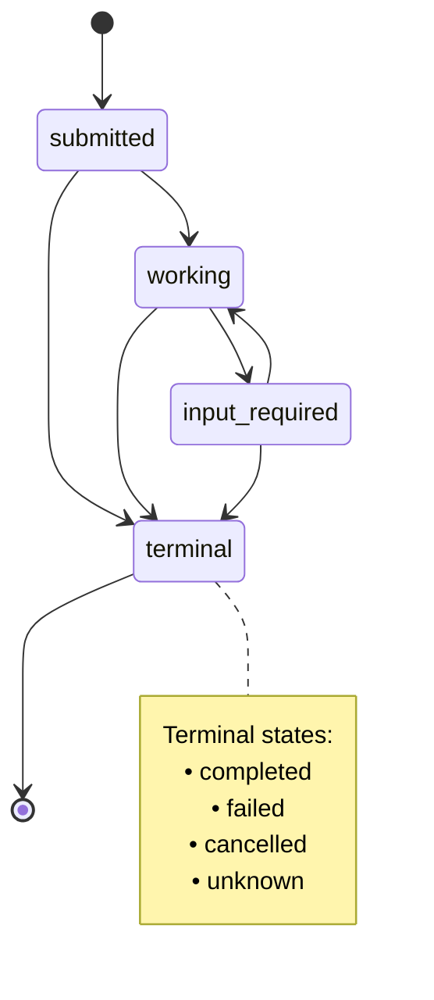
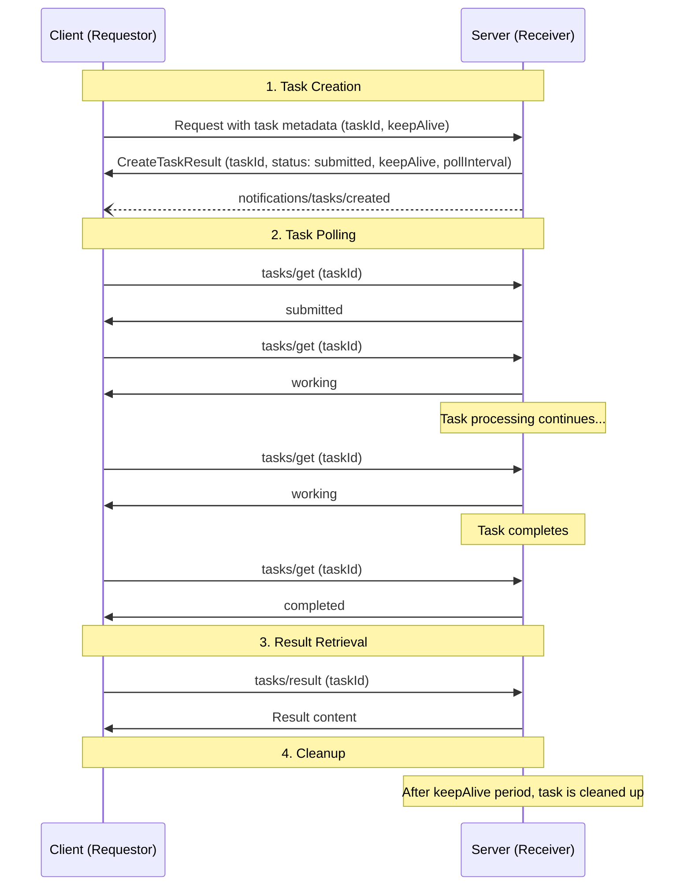
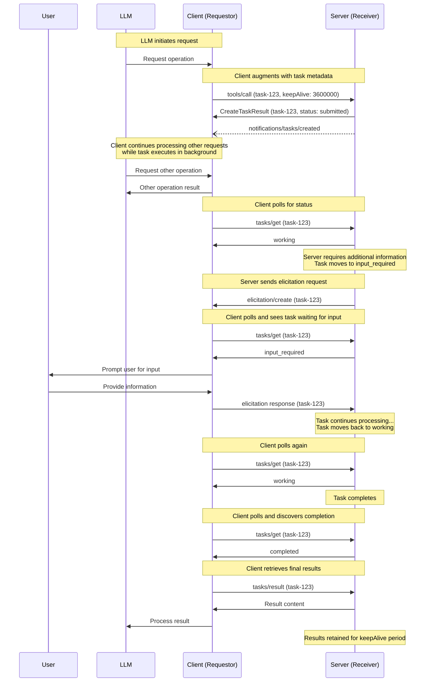
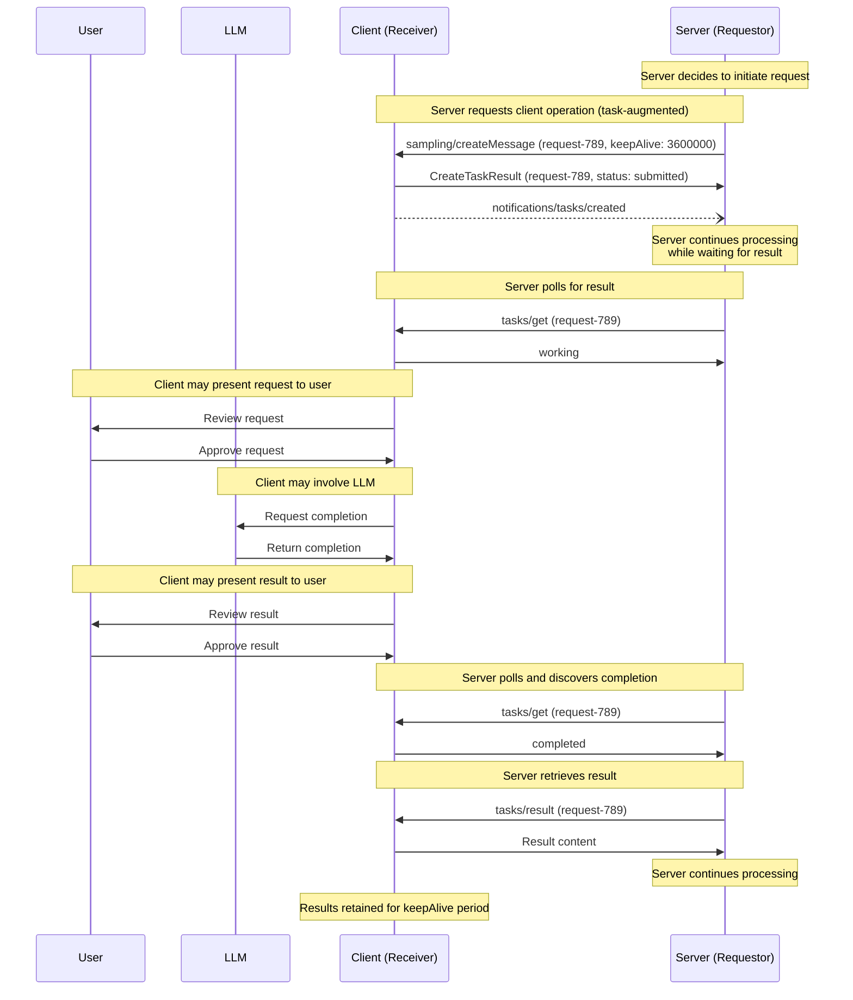
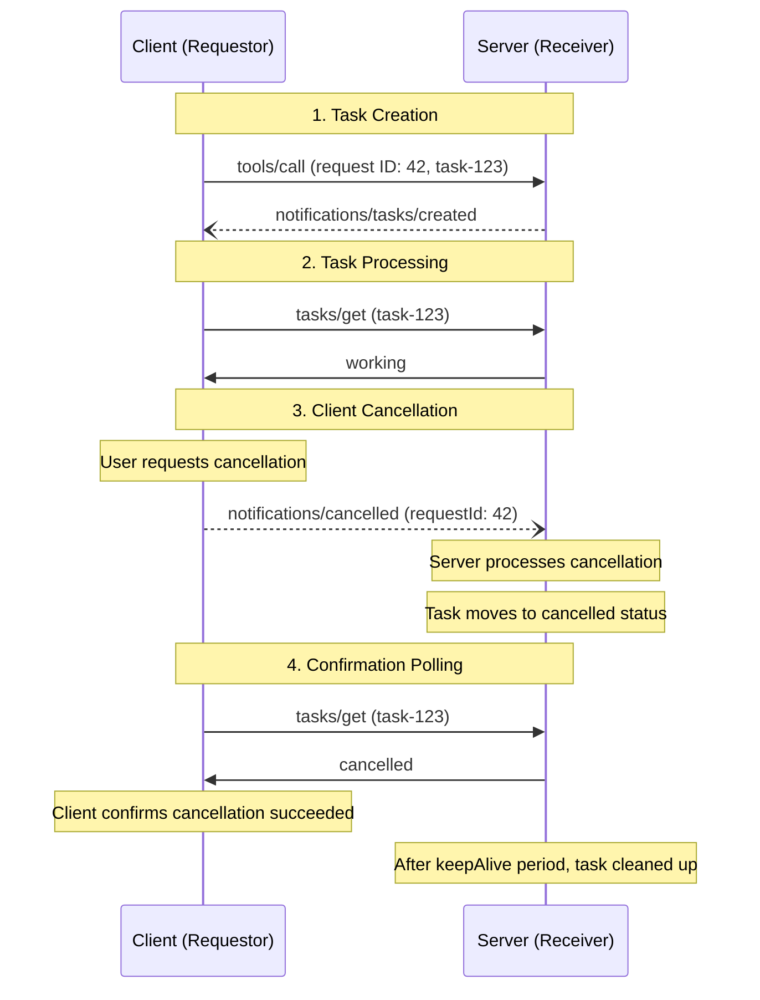
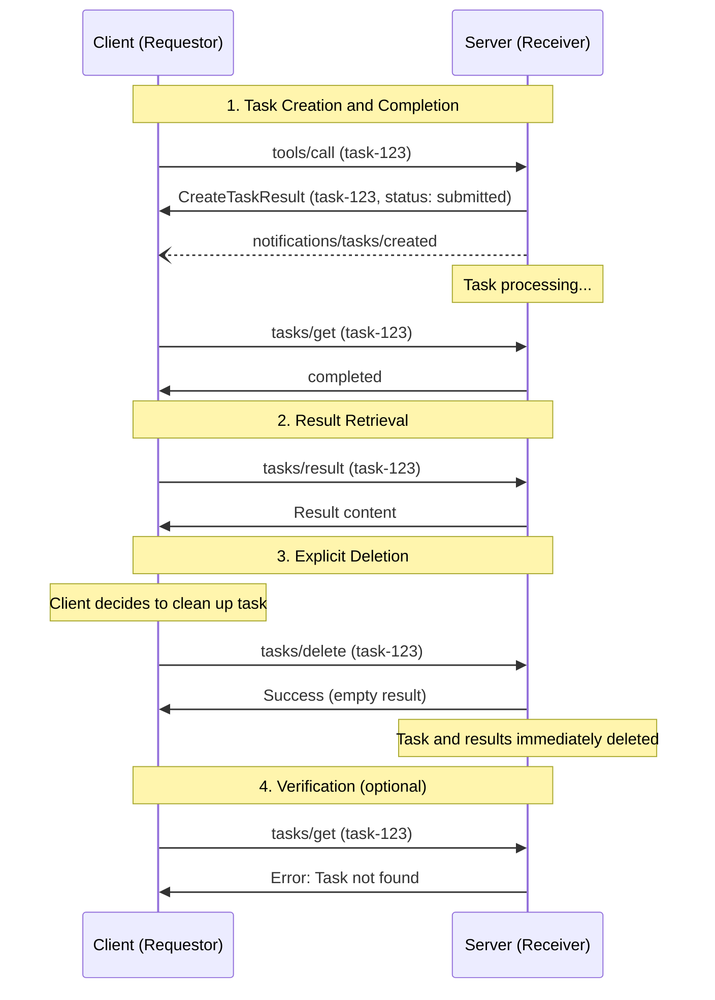

<div id="enable-section-numbers" />

<Info>**Protocol Revision**: draft</Info>

The Model Context Protcol (MCP) allows requestors (which can be either clients or servers, depending on the direction of communication) to augment their requests with **tasks**. Tasks are durable state machines that carry information about the underlying execution state of the request they wrap, and are intended for requestor polling and deferred result retrieval. Each task is uniquely identifiable by a receiver-generated **task ID**.

## User Interaction Model

Tasks are designed to be **application-driven**—receivers tightly-control which requests (if any) support task-based execution and manage the lifecycles of those tasks; meanwhile, requestors own the responsibility for augmenting requests with tasks, and for polling on the results of those tasks.

Implementations are free to expose tasks through any interface pattern that suits their needs—the protocol itself does not mandate any specific user interaction model.

## Capabilities

Servers and clients that support task-augmented requests **MUST** declare a `tasks` capability during initialization. The `tasks` capability is structured by request category, with boolean properties indicating which specific request types support task augmentation.

### Server Capabilities

Servers declare if they support tasks, and if so, which server-side requests can be augmented with tasks:

```json
{
  "capabilities": {
    "tasks": {
      "list": {},
      "delete": {},
      "requests": {
        "tools": {
          "call": {}
        }
      }
    }
  }
}
```

### Client Capabilities

Clients declare if they support tasks, and if so, which client-side requests can be augmented with tasks:

```json
{
  "capabilities": {
    "tasks": {
      "list": {},
      "delete": {},
      "requests": {
        "sampling": {
          "createMessage": {}
        },
        "elicitation": {
          "create": {}
        }
      }
    }
  }
}
```

### Capability Negotiation

During the initialization phase, both parties exchange their `tasks` capabilities to establish which operations support task-based execution. Requestors **MUST** only augment requests with task metadata if the corresponding capability has been declared by the receiver.

For example, if a server's capabilities include `tasks.requests.tools.call: true`, then clients may augment `tools/call` requests with task metadata. If a client's capabilities include `tasks.requests.sampling.createMessage: true`, then servers may augment `sampling/createMessage` requests with task metadata.

If `capabilities.tasks` is not defined, the peer **MUST NOT** attempt to create tasks during requests.

The set of capabilities in `capabilities.tasks.requests` is exhaustive. If a request type is not present, it does not support task-augmentation.

`capabilities.tasks.list` controls if the `tasks/list` operation is supported by the party.

`capabilities.tasks.delete` controls if the `tasks/delete` operation is supported by the party.

### Tool-Level Negotiation

Tool calls are given special consideration for the purpose of task augmentation. In the result of `tools/list`, tools declare support for tasks via `annotations.taskHint`.

This is to be interpreted as a fine-grained layer in addition to capabilities. If a server's capabilities include `tasks.requests.tools.call: false`, then clients **MUST NOT** attempt to use task augmentation on that server's tools, even if they declare tool-level support via `annotations.taskHint`.

## Protocol Messages

### Creating Tasks

Task-augmented requests follow a two-phase response pattern that differs from normal requests:

- **Normal requests**: The server processes the request and returns the actual operation result directly.
- **Task-augmented requests**: The server accepts the request and immediately returns a `CreateTaskResult` containing task metadata. The actual operation result becomes available later through `tasks/result` after the task completes.

To create a task, requestors send a request with the `modelcontextprotocol.io/task` key included in `_meta`. Requestors **MAY** include a `keepAlive` value representing how long after completion the requestor would like the task results to be kept for.

**Request:**

```json
{
  "jsonrpc": "2.0",
  "id": 1,
  "method": "tools/call",
  "params": {
    "name": "get_weather",
    "arguments": {
      "city": "New York"
    },
    "_meta": {
      "modelcontextprotocol.io/task": {
        "keepAlive": 60000
      }
    }
  }
}
```

**Response:**

```json
{
  "jsonrpc": "2.0",
  "id": 1,
  "result": {
    "taskId": "786512e2-9e0d-44bd-8f29-789f320fe840",
    "status": "submitted",
    "keepAlive": 60000,
    "pollInterval": 5000,
    "_meta": {
      "modelcontextprotocol.io/related-task": {
        "taskId": "786512e2-9e0d-44bd-8f29-789f320fe840"
      }
    }
  }
}
```

When a receiver accepts a task-augmented request, it returns a `CreateTaskResult` containing task metadata. This response does not include the actual operation result. The actual result (e.g., tool result for `tools/call`) becomes available only through `tasks/result` after the task completes.

### Getting Tasks

To retrieve the state of a task, requestors send a `tasks/get` request:

**Request:**

```json
{
  "jsonrpc": "2.0",
  "id": 3,
  "method": "tasks/get",
  "params": {
    "taskId": "786512e2-9e0d-44bd-8f29-789f320fe840"
  }
}
```

**Response:**

```json
{
  "jsonrpc": "2.0",
  "id": 3,
  "result": {
    "taskId": "786512e2-9e0d-44bd-8f29-789f320fe840",
    "keepAlive": 30000,
    "pollInterval": 5000,
    "status": "submitted",
    "_meta": {
      "modelcontextprotocol.io/related-task": {
        "taskId": "786512e2-9e0d-44bd-8f29-789f320fe840"
      }
    }
  }
}
```

### Retrieving Task Results

After a task completes, the actual operation result is retrieved via `tasks/result`. This is distinct from the initial `CreateTaskResult` response, which contains only task metadata. The result structure matches the original request type (e.g., `CallToolResult` for `tools/call`).

To retrieve the result of a completed task, requestors send a `tasks/result` request:

**Request:**

```json
{
  "jsonrpc": "2.0",
  "id": 4,
  "method": "tasks/result",
  "params": {
    "taskId": "786512e2-9e0d-44bd-8f29-789f320fe840"
  }
}
```

**Response:**

```json
{
  "jsonrpc": "2.0",
  "id": 4,
  "result": {
    "content": [
      {
        "type": "text",
        "text": "Current weather in New York:\nTemperature: 72°F\nConditions: Partly cloudy"
      }
    ],
    "isError": false,
    "_meta": {
      "modelcontextprotocol.io/related-task": {
        "taskId": "786512e2-9e0d-44bd-8f29-789f320fe840"
      }
    }
  }
}
```

### Task Creation Notification

When a receiver creates a task, it **MUST** send a `notifications/tasks/created` notification to inform the requestor that the task has been created and polling can begin.

**Notification:**

```json
{
  "jsonrpc": "2.0",
  "method": "notifications/tasks/created",
  "params": {
    "_meta": {
      "modelcontextprotocol.io/related-task": {
        "taskId": "786512e2-9e0d-44bd-8f29-789f320fe840"
      }
    }
  }
}
```

The task ID is conveyed through the `modelcontextprotocol.io/related-task` metadata key. The notification parameters are otherwise empty.

This notification resolves the race condition where a requestor might attempt to poll for a task before the receiver has finished creating it. By sending this notification immediately after task creation, the receiver signals that the task is ready to be queried via `tasks/get`.

Receivers that do not support tasks (and thus ignore task metadata in requests) will not send this notification, allowing requestors to fall back to waiting for the original request response.

### Task Status Notification

When a task's status changes, receivers **MAY** send a `notifications/tasks/status` notification to inform the requestor of the change.

**Notification:**

```json
{
  "jsonrpc": "2.0",
  "method": "notifications/tasks/status",
  "params": {
    "status": "completed",
    "_meta": {
      "modelcontextprotocol.io/related-task": {
        "taskId": "786512e2-9e0d-44bd-8f29-789f320fe840"
      }
    }
  }
}
```

The notification includes:

- `status`: The new task status
- `error` (optional): Error message if the status is `failed`

The task ID is conveyed through the `modelcontextprotocol.io/related-task` metadata key.

Requestors **MUST NOT** rely on receiving these notifications, as they are optional. Receivers are not required to send status notifications and may choose to only send them for certain status transitions. Requestors **SHOULD** continue to poll via `tasks/get` to ensure they receive status updates.

### Listing Tasks

To retrieve a list of tasks, requestors send a `tasks/list` request. This operation supports pagination.

**Request:**

```json
{
  "jsonrpc": "2.0",
  "id": 5,
  "method": "tasks/list",
  "params": {
    "cursor": "optional-cursor-value"
  }
}
```

**Response:**

```json
{
  "jsonrpc": "2.0",
  "id": 5,
  "result": {
    "tasks": [
      {
        "taskId": "786512e2-9e0d-44bd-8f29-789f320fe840",
        "status": "working",
        "keepAlive": 30000,
        "pollInterval": 5000
      },
      {
        "taskId": "abc123-def456-ghi789",
        "status": "completed",
        "keepAlive": 60000
      }
    ],
    "nextCursor": "next-page-cursor"
  }
}
```

### Deleting Tasks

To explicitly delete a task and its associated results, requestors send a `tasks/delete` request.

**Request:**

```json
{
  "jsonrpc": "2.0",
  "id": 6,
  "method": "tasks/delete",
  "params": {
    "taskId": "786512e2-9e0d-44bd-8f29-789f320fe840"
  }
}
```

**Response:**

```json
{
  "jsonrpc": "2.0",
  "id": 6,
  "result": {
    "_meta": {
      "modelcontextprotocol.io/related-task": {
        "taskId": "786512e2-9e0d-44bd-8f29-789f320fe840"
      }
    }
  }
}
```

## Behavior Requirements

These requirements apply to all parties that support receiving task-augmented requests.

### Task Support and Handling

1. Receivers that do not declare the task capability for a request type **MUST** process requests of that type normally, ignoring any task-augmentation metadata if present.
1. Receivers that do declare the task capability for a request type **MAY** return an error for non-task-augmented requests of that type, requiring requestors to use task augmentation.

### Task ID Requirements

1. Task IDs **MUST** be a string value.
1. Task IDs **MUST** be generated by the receiver when creating a task.
1. Task IDs **MUST** be unique across all tasks controlled by the receiver.

### Task Status Lifecycle

1. Tasks **MUST** begin in the `submitted` status when created.
1. Receivers **MUST** only transition tasks through the following valid paths:
   1. From `submitted`: may move to `working`, `input_required`, `completed`, `failed`, `cancelled`, or `unknown`
   1. From `working`: may move to `input_required`, `completed`, `failed`, `cancelled`, or `unknown`
   1. From `input_required`: may move to `working`, `completed`, `failed`, `cancelled`, or `unknown`
   1. Tasks in `completed`, `failed`, `cancelled`, or `unknown` status **MUST NOT** transition to any other status (terminal states)
1. Receivers **MAY** move directly from `submitted` to `completed` if execution completes immediately.
1. The `unknown` status is a terminal fallback state for unexpected error conditions. Receivers **SHOULD** use `failed` with an error message instead when possible.

**Task Status State Diagram:**



### Input Required Status

1. When a receiver sends a request associated with a task (e.g., elicitation, sampling), the receiver **SHOULD** move the task to the `input_required` status.
1. The receiver **MUST** include the `modelcontextprotocol.io/related-task` metadata in the request to associate it with the task.
1. When the receiver receives all required responses, the task **MAY** transition out of `input_required` status (typically back to `working`).
1. If multiple related requests are pending, the task **SHOULD** remain in `input_required` status until all are resolved.

### Keep-Alive and Resource Management

1. Receivers **MAY** override the requested `keepAlive` duration.
1. Receivers **MUST** include the actual `keepAlive` duration (or `null` for unlimited) in `tasks/get` responses.
1. After a task reaches a terminal status (`completed`, `failed`, or `cancelled`) and its `keepAlive` duration has elapsed, receivers **MAY** delete the task and its results.
1. Receivers **MAY** include a `pollInterval` value (in milliseconds) in `tasks/get` responses to suggest polling intervals. Requestors **SHOULD** respect this value when provided.

### Result Retrieval

1. Receivers that accept a task-augmented request **MUST** return a `CreateTaskResult` as the response. This result **SHOULD** be returned as soon as possible after accepting the task.
1. When a receiver receives a `tasks/result` request, it **MUST** block the response until the task reaches a terminal status (`completed`, `failed`, `cancelled`, or `unknown`).
1. For tasks in `completed` status, receivers **MUST** return the actual operation results as specified by the original request type.
1. For tasks in `failed`, `cancelled`, or `unknown` status, receivers **MUST** return a successful JSON-RPC response containing error or status details in the result structure.

### Associating Task-Related Messages

1. All requests, notifications, and responses related to a task **MUST** include the `modelcontextprotocol.io/related-task` key in their `_meta`, with the value set to an object with a `taskId` matching the associated task ID.
1. For example, an elicitation that a task-augmented tool call depends on **MUST** share the same related task ID with that tool call's task.
1. For the `tasks/get`, `tasks/list`, `tasks/result`, and `tasks/delete` operations, the `taskId` parameter in the request **MUST** be used as the source of truth for identifying the target task. Requestors **SHOULD NOT** include `modelcontextprotocol.io/related-task` metadata in these requests, and receivers **MUST** ignore such metadata if present in favor of the RPC method parameter.

### Task Cancellation

1. When a receiver receives a `notifications/cancelled` notification for the JSON-RPC request ID of a task-augmented request, the receiver **SHOULD** immediately move the task to the `cancelled` status and cease all processing associated with that task.
1. Due to the asynchronous nature of notifications, receivers **MAY** not cancel task processing instantaneously. Receivers **SHOULD** make a best-effort attempt to halt execution as quickly as possible.
1. If a `notifications/cancelled` notification arrives after a task has already reached a terminal status (`completed`, `failed`, `cancelled`, or `unknown`), receivers **SHOULD** ignore the notification.
1. After a task reaches `cancelled` status and its `keepAlive` duration has elapsed, receivers **MAY** delete the task and its metadata.
1. Requestors **MAY** send `notifications/cancelled` at any time during task execution, including when the task is in `input_required` status. If a task is cancelled while in `input_required` status, receivers **SHOULD** also disregard any pending responses to associated requests.
1. Because notifications do not provide confirmation of receipt, requestors **SHOULD** continue to poll with `tasks/get` after sending a cancellation notification to confirm the task has transitioned to `cancelled` status. If the task does not transition to `cancelled` within a reasonable timeframe, requestors **MAY** assume the cancellation was not processed.

### Task Listing

1. Receivers **SHOULD** use cursor-based pagination to limit the number of tasks returned in a single response.
1. Receivers **MUST** include a `nextCursor` in the response if more tasks are available.
1. Requestors **MUST** treat cursors as opaque tokens and not attempt to parse or modify them.
1. If a task is retrievable via `tasks/get` for a requestor, it **MUST** be retrievable via `tasks/list` for that requestor.

### Task Deletion

1. Receivers **MAY** accept or reject delete requests for any task at their discretion.
1. If a receiver accepts a delete request, it **SHOULD** delete the task and all associated results and metadata.
1. Receivers **MAY** choose not to support deletion at all, or only support deletion for tasks in certain statuses (e.g., only terminal statuses).
1. Requestors **SHOULD** delete tasks containing sensitive data promptly rather than relying solely on `keepAlive` expiration for cleanup.

## Message Flow

### Basic Task Lifecycle



### Task-Augmented Tool Call With Elicitation



### Task-Augmented Sampling Request



### Task Cancellation Flow



### Task Deletion Flow



## Data Types

### Task

A task represents the execution state of a request. The task metadata includes:

- `taskId`: Unique identifier for the task
- `keepAlive`: Time in milliseconds that results will be kept available after completion
- `pollInterval`: Suggested time in milliseconds between status checks
- `status`: Current state of the task execution

### Task Status

Tasks can be in one of the following states:

- `submitted`: The request has been received and queued for execution
- `working`: The request is currently being processed
- `input_required`: The request is waiting on additional input from the requestor
- `completed`: The request completed successfully and results are available
- `failed`: The associated request did not complete successfully. For tool calls specifically, this includes cases where the tool call result has `isError` set to true.
- `cancelled`: The request was cancelled before completion
- `unknown`: A terminal fallback state for unexpected error conditions when the receiver cannot determine the actual task state

### Task Metadata

When augmenting a request with task execution, the `modelcontextprotocol.io/task` key is included in `_meta`:

```json
{
  "modelcontextprotocol.io/task": {
    "keepAlive": 60000
  }
}
```

Fields:

- `keepAlive` (number, optional): Requested duration in milliseconds to retain results after completion

### Related Task Metadata

All requests, responses, and notifications associated with a task **MUST** include the `modelcontextprotocol.io/related-task` key in `_meta`:

```json
{
  "modelcontextprotocol.io/related-task": {
    "taskId": "786512e2-9e0d-44bd-8f29-789f320fe840"
  }
}
```

This associates messages with their originating task across the entire request lifecycle.

## Error Handling

Tasks use two error reporting mechanisms:

1. **Protocol Errors**: Standard JSON-RPC errors for protocol-level issues
1. **Task Execution Errors**: Errors in the underlying request execution, reported through task status

### Protocol Errors

Receivers **MUST** return standard JSON-RPC errors for the following protocol error cases:

- Invalid or nonexistent `taskId` in `tasks/get`, `tasks/list`, `tasks/result`, or `tasks/delete`: `-32602` (Invalid params)
- Invalid or nonexistent cursor in `tasks/list`: `-32602` (Invalid params)
- Receiver rejects a `tasks/delete` request: `-32600` (Invalid request)
- Internal errors: `-32603` (Internal error)

Additionally, receivers **MAY** return the following errors:

- Non-task-augmented request when receiver requires task augmentation for that request type: `-32600` (Invalid request)

Receivers **SHOULD** provide informative error messages to describe the cause of errors.

**Example: Task augmentation required**

```json
{
  "jsonrpc": "2.0",
  "id": 1,
  "error": {
    "code": -32600,
    "message": "Task augmentation required for tools/call requests"
  }
}
```

**Example: Task not found**

```json
{
  "jsonrpc": "2.0",
  "id": 70,
  "error": {
    "code": -32602,
    "message": "Failed to retrieve task: Task not found"
  }
}
```

**Example: Task expired**

```json
{
  "jsonrpc": "2.0",
  "id": 71,
  "error": {
    "code": -32602,
    "message": "Failed to retrieve task: Task has expired"
  }
}
```

<Note>

Receivers are not obligated to retain task metadata indefinitely. It is compliant behavior for a receiver to return a "not-found" error if it has purged an expired task.

</Note>

**Example: Task deletion rejected by receiver**

```json
{
  "jsonrpc": "2.0",
  "id": 74,
  "error": {
    "code": -32600,
    "message": "Task deletion not supported for tasks in 'working' status"
  }
}
```

### Task Execution Errors

When the underlying request does not complete successfully, the task moves to the `failed` status. This includes JSON-RPC protocol errors during request execution, or for tool calls specifically, when the tool result has `isError` set to true. The `tasks/get` response **SHOULD** include an `error` field with details about the failure.

**Example: Task with execution error**

```json
{
  "jsonrpc": "2.0",
  "id": 4,
  "result": {
    "taskId": "786512e2-9e0d-44bd-8f29-789f320fe840",
    "status": "failed",
    "keepAlive": 30000,
    "error": "Tool execution failed: API rate limit exceeded"
  }
}
```

For tasks that wrap tool call requests, when the tool result has `isError` set to true, the task should reach `failed` status.

## Security Considerations

### Task Isolation and Access Control

1. Receivers **SHOULD** scope task IDs to prevent unauthorized access:
   1. Bind tasks to the session that created them (if sessions are supported)
   1. Bind tasks to the authentication context (if authentication is used)
   1. Reject `tasks/get`, `tasks/list`, `tasks/result`, or `tasks/delete` requests for tasks from different sessions or auth contexts
1. Receivers that do not implement session or authentication binding **SHOULD** document this limitation clearly, as task results may be accessible to any requestor that can guess the task ID.
1. Receivers **SHOULD** implement rate limiting on:
   1. Task creation to prevent resource exhaustion
   1. Task status polling to prevent denial of service
   1. Task result retrieval attempts
   1. Task listing requests to prevent denial of service
   1. Task deletion requests to prevent abuse

### Resource Management

<Warning>

Task results may persist longer than the original request execution time. For sensitive operations, requestors should carefully consider the security implications of extended result retention and may want to retrieve results promptly and request shorter `keepAlive` durations. Requestors are encouraged to use `tasks/delete` to explicitly clean up tasks containing sensitive data rather than relying solely on `keepAlive` expiration.

</Warning>

1. Receivers **SHOULD**:
   1. Enforce limits on concurrent tasks per requestor
   1. Enforce maximum `keepAlive` durations to prevent indefinite resource retention
   1. Clean up expired tasks promptly to free resources
1. Receivers **SHOULD**:
   1. Document maximum supported `keepAlive` duration
   1. Document maximum concurrent tasks per requestor
   1. Implement monitoring and alerting for resource usage

### Audit and Logging

1. Receivers **SHOULD**:
   1. Log task creation, completion, and retrieval events for audit purposes
   1. Include session/auth context in logs when available
   1. Monitor for suspicious patterns (e.g., many failed task lookups, excessive polling)
1. Requestors **SHOULD**:
   1. Log task lifecycle events for debugging and audit purposes
   1. Track task IDs and their associated operations
