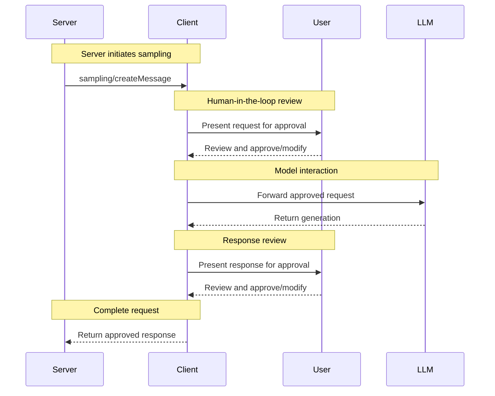

<div id="enable-section-numbers" />

<Info>**Protocol Revision**: draft</Info>

The Model Context Protocol (MCP) provides a standardized way for servers to request LLM
sampling ("completions" or "generations") from language models via clients. This flow
allows clients to maintain control over model access, selection, and permissions while
enabling servers to leverage AI capabilities&mdash;with no server API keys necessary.
Servers can request text, audio, or image-based interactions and optionally include
context from MCP servers in their prompts.

## User Interaction Model

Sampling in MCP allows servers to implement agentic behaviors, by enabling LLM calls to
occur _nested_ inside other MCP server features.

Implementations are free to expose sampling through any interface pattern that suits
their needs&mdash;the protocol itself does not mandate any specific user interaction
model.

<Warning>

For trust & safety and security, there **SHOULD** always
be a human in the loop with the ability to deny sampling requests.

Applications **SHOULD**:

- Provide UI that makes it easy and intuitive to review sampling requests
- Allow users to view and edit prompts before sending
- Present generated responses for review before delivery

</Warning>

## Tool Calling in Sampling

Servers can request that the client's LLM use tools during sampling by providing a `tools` array and optional `toolChoice` configuration in their sampling requests. This enables servers to implement agentic behaviors where the LLM can call tools, receive results, and continue the conversation&mdash;all within a single sampling request flow.

**Key capabilities:**

- Servers define tools with JSON schemas for inputs and outputs
- The LLM decides when and how to call tools (subject to `toolChoice` constraints)
- Multiple tools can be called in parallel
- Tool results are provided back to the LLM to inform subsequent responses

Clients **MUST** declare support for tool calling via the `sampling.tools` capability to receive tool-enabled sampling requests.

<Info>
  Tool calling in sampling uses the same `Tool` type as regular MCP tool calls,
  ensuring consistency across the protocol.
</Info>

## Capabilities

Clients that support sampling **MUST** declare the `sampling` capability during
[initialization](/specification/draft/basic/lifecycle#initialization):

**Basic sampling:**

```json
{
  "capabilities": {
    "sampling": {}
  }
}
```

**With tool calling support:**

```json
{
  "capabilities": {
    "sampling": {
      "tools": {}
    }
  }
}
```

**With context inclusion support (soft-deprecated):**

```json
{
  "capabilities": {
    "sampling": {
      "context": {}
    }
  }
}
```

<Note>
  The `includeContext` parameter values `"thisServer"` and `"allServers"` are
  soft-deprecated. Servers SHOULD avoid using these values, and MUST NOT use
  them unless the client declares `sampling.context` capability. These values
  may be removed in future spec releases.
</Note>

## Protocol Messages

### Creating Messages

To request a language model generation, servers send a `sampling/createMessage` request:

**Request:**

```json
{
  "jsonrpc": "2.0",
  "id": 1,
  "method": "sampling/createMessage",
  "params": {
    "messages": [
      {
        "role": "user",
        "content": {
          "type": "text",
          "text": "What is the capital of France?"
        }
      }
    ],
    "modelPreferences": {
      "hints": [
        {
          "name": "claude-3-sonnet"
        }
      ],
      "intelligencePriority": 0.8,
      "speedPriority": 0.5
    },
    "systemPrompt": "You are a helpful assistant.",
    "maxTokens": 100
  }
}
```

**Response:**

```json
{
  "jsonrpc": "2.0",
  "id": 1,
  "result": {
    "role": "assistant",
    "content": {
      "type": "text",
      "text": "The capital of France is Paris."
    },
    "model": "claude-3-sonnet-20240307",
    "stopReason": "endTurn"
  }
}
```

### Sampling with Tools

To request LLM generation with tool calling capabilities, servers include `tools` and optionally `toolChoice` in the request:

**Request:**

```json
{
  "jsonrpc": "2.0",
  "id": 1,
  "method": "sampling/createMessage",
  "params": {
    "messages": [
      {
        "role": "user",
        "content": {
          "type": "text",
          "text": "What's the weather like in Paris and London?"
        }
      }
    ],
    "tools": [
      {
        "name": "get_weather",
        "description": "Get current weather for a city",
        "inputSchema": {
          "type": "object",
          "properties": {
            "city": {
              "type": "string",
              "description": "City name"
            }
          },
          "required": ["city"]
        }
      }
    ],
    "toolChoice": {
      "mode": "auto"
    },
    "maxTokens": 1000
  }
}
```

**Response (parallel tool calls):**

```json
{
  "jsonrpc": "2.0",
  "id": 1,
  "result": {
    "role": "assistant",
    "content": [
      {
        "type": "tool_use",
        "id": "call_abc123",
        "name": "get_weather",
        "input": {
          "city": "Paris"
        }
      },
      {
        "type": "tool_use",
        "id": "call_def456",
        "name": "get_weather",
        "input": {
          "city": "London"
        }
      }
    ],
    "model": "claude-3-sonnet-20240307",
    "stopReason": "toolUse"
  }
}
```

### Multi-turn Tool Loop

After receiving tool calls from the LLM, the server typically:

1. Executes the requested tools
2. Sends a new sampling request with the tool results
3. Receives the LLM's final response

**Follow-up request with tool results:**

```json
{
  "jsonrpc": "2.0",
  "id": 2,
  "method": "sampling/createMessage",
  "params": {
    "messages": [
      {
        "role": "user",
        "content": {
          "type": "text",
          "text": "What's the weather like in Paris and London?"
        }
      },
      {
        "role": "assistant",
        "content": [
          {
            "type": "tool_use",
            "id": "call_abc123",
            "name": "get_weather",
            "input": { "city": "Paris" }
          },
          {
            "type": "tool_use",
            "id": "call_def456",
            "name": "get_weather",
            "input": { "city": "London" }
          }
        ]
      },
      {
        "role": "user",
        "content": [
          {
            "type": "tool_result",
            "toolUseId": "call_abc123",
            "content": [
              {
                "type": "text",
                "text": "Weather in Paris: 18°C, partly cloudy"
              }
            ]
          },
          {
            "type": "tool_result",
            "toolUseId": "call_def456",
            "content": [
              {
                "type": "text",
                "text": "Weather in London: 15°C, rainy"
              }
            ]
          }
        ]
      }
    ],
    "tools": [
      {
        "name": "get_weather",
        "description": "Get current weather for a city",
        "inputSchema": {
          "type": "object",
          "properties": {
            "city": { "type": "string" }
          },
          "required": ["city"]
        }
      }
    ],
    "maxTokens": 1000
  }
}
```

**Final response:**

```json
{
  "jsonrpc": "2.0",
  "id": 2,
  "result": {
    "role": "assistant",
    "content": {
      "type": "text",
      "text": "Based on the current weather data:\n\n- **Paris**: 18°C and partly cloudy - quite pleasant!\n- **London**: 15°C and rainy - you'll want an umbrella.\n\nParis has slightly warmer and drier conditions today."
    },
    "model": "claude-3-sonnet-20240307",
    "stopReason": "endTurn"
  }
}
```

## Message Content Constraints

### Tool Result Messages

When a user message contains tool results (type: "tool_result"), it **MUST** contain ONLY tool results. Mixing tool results with other content types (text, image, audio) in the same message is not allowed.

This constraint ensures compatibility with provider APIs that use dedicated roles for tool results (e.g., OpenAI's "tool" role, Gemini's "function" role).

**Valid - single tool result:**

```json
{
  "role": "user",
  "content": {
    "type": "tool_result",
    "toolUseId": "call_123",
    "content": [{ "type": "text", "text": "Result data" }]
  }
}
```

**Valid - multiple tool results:**

```json
{
  "role": "user",
  "content": [
    {
      "type": "tool_result",
      "toolUseId": "call_123",
      "content": [{ "type": "text", "text": "Result 1" }]
    },
    {
      "type": "tool_result",
      "toolUseId": "call_456",
      "content": [{ "type": "text", "text": "Result 2" }]
    }
  ]
}
```

**Invalid - mixed content:**

```json
{
  "role": "user",
  "content": [
    {
      "type": "text",
      "text": "Here are the results:"
    },
    {
      "type": "tool_result",
      "toolUseId": "call_123",
      "content": [{ "type": "text", "text": "Result data" }]
    }
  ]
}
```

<Note>
  If additional context is needed alongside tool results: - Include it in the
  tool result's `content` field, OR - Send it in a separate user message before
  or after the tool results, OR - Include it in the system prompt
</Note>

### Tool Use and Result Balance

When using tool calling in sampling, messages **MUST** be properly balanced: every assistant message containing `ToolUseContent` (with `id: $id`) must be followed by a user message containing corresponding `ToolResultContent` (with `toolUseId: $id`) before the next assistant message.

This requirement ensures:

- Tool calls are always resolved before the conversation continues
- Provider APIs (especially Claude API) can process parallel tool calls correctly
- The conversation maintains a consistent request-response pattern

**Valid sequence:**

1. User message: "What's the weather in Paris?"
2. Assistant message: ToolUseContent (id: "call_123")
3. User message: ToolResultContent (toolUseId: "call_123")
4. Assistant message: Text response using the result

**Invalid sequence:**

1. User message: "What's the weather in Paris?"
2. Assistant message: ToolUseContent (id: "call_123")
3. Assistant message: Another response (missing tool result)

## Cross-API Compatibility

The sampling specification is designed to work across multiple LLM provider APIs (Claude, OpenAI, Gemini, etc.). Key design decisions for compatibility:

### Tool Identification

While MCP requires tool call IDs (`ToolUseContent.id` and `ToolResultContent.toolUseId`), implementations wrapping APIs without native ID support (like Gemini) can:

- Generate synthetic IDs for outgoing tool calls
- Match results by position when receiving function responses
- Reorder results to match tool call IDs

### Message Roles

MCP uses two roles: "user" and "assistant". Tool results are sent as user messages. Implementations can map this to provider-specific roles:

- **Claude API**: Uses "user" and "assistant" with content-based tool calls (direct mapping)
- **OpenAI API**: Uses "tool" role for results → map MCP user messages with tool results to "tool" role
- **Gemini API**: Uses "function" role for results → map MCP user messages with tool results to "function" role

The constraint that tool result messages cannot contain mixed content types ensures clean mapping to all provider APIs.

### Tool Choice Modes

MCP's `toolChoice.mode` values map to provider APIs:

| MCP          | Claude API       | OpenAI API | Gemini API |
| ------------ | ---------------- | ---------- | ---------- |
| `"auto"`     | `{type: "auto"}` | `auto`     | `AUTO`     |
| `"required"` | `{type: "any"}`  | `required` | `ANY`      |
| `"none"`     | `{type: "none"}` | `none`     | `NONE`     |

### Parallel Tool Calling

MCP allows models to make multiple tool calls in parallel (returning an array of `ToolUseContent`). All major provider APIs support this:

- **Claude**: Supports parallel tool use natively
- **OpenAI**: Supports parallel tool calls (can be disabled with `parallel_tool_calls: false`)
- **Gemini**: Supports parallel function calls natively

Implementations wrapping providers that support disabling parallel calls MAY expose this as an extension, but it is not part of the core MCP specification.

## Message Flow



## Data Types

### Messages

Sampling messages can contain:

#### Text Content

```json
{
  "type": "text",
  "text": "The message content"
}
```

#### Image Content

```json
{
  "type": "image",
  "data": "base64-encoded-image-data",
  "mimeType": "image/jpeg"
}
```

#### Audio Content

```json
{
  "type": "audio",
  "data": "base64-encoded-audio-data",
  "mimeType": "audio/wav"
}
```

### Model Preferences

Model selection in MCP requires careful abstraction since servers and clients may use
different AI providers with distinct model offerings. A server cannot simply request a
specific model by name since the client may not have access to that exact model or may
prefer to use a different provider's equivalent model.

To solve this, MCP implements a preference system that combines abstract capability
priorities with optional model hints:

#### Capability Priorities

Servers express their needs through three normalized priority values (0-1):

- `costPriority`: How important is minimizing costs? Higher values prefer cheaper models.
- `speedPriority`: How important is low latency? Higher values prefer faster models.
- `intelligencePriority`: How important are advanced capabilities? Higher values prefer
  more capable models.

#### Model Hints

While priorities help select models based on characteristics, `hints` allow servers to
suggest specific models or model families:

- Hints are treated as substrings that can match model names flexibly
- Multiple hints are evaluated in order of preference
- Clients **MAY** map hints to equivalent models from different providers
- Hints are advisory&mdash;clients make final model selection

For example:

```json
{
  "hints": [
    { "name": "claude-3-sonnet" }, // Prefer Sonnet-class models
    { "name": "claude" } // Fall back to any Claude model
  ],
  "costPriority": 0.3, // Cost is less important
  "speedPriority": 0.8, // Speed is very important
  "intelligencePriority": 0.5 // Moderate capability needs
}
```

The client processes these preferences to select an appropriate model from its available
options. For instance, if the client doesn't have access to Claude models but has Gemini,
it might map the sonnet hint to `gemini-1.5-pro` based on similar capabilities.

## Error Handling

Clients **SHOULD** return errors for common failure cases:

Example error:

```json
{
  "jsonrpc": "2.0",
  "id": 1,
  "error": {
    "code": -1,
    "message": "User rejected sampling request"
  }
}
```

## Security Considerations

1. Clients **SHOULD** implement user approval controls for both sampling requests and tool calls
2. Clients **SHOULD** present clear information about which tools the LLM may call
3. Both parties **SHOULD** validate message content and tool parameters
4. Clients **SHOULD** respect model preference hints
5. Clients **SHOULD** implement rate limiting for both sampling requests and tool executions
6. Both parties **MUST** handle sensitive data appropriately
7. Servers **SHOULD** validate tool results before using them in application logic
8. Clients **SHOULD** sanitize tool call arguments before execution
9. Clients **SHOULD** implement timeouts for tool executions to prevent resource exhaustion
10. Clients **MUST** validate that tool call IDs match tool result toolUseIds
11. Both parties **SHOULD** implement iteration limits to prevent runaway tool loops
12. Servers **MUST** validate that user messages with tool results do not contain mixed content types

<Warning>

### Tool Calling Security

When implementing tool calling in sampling:

- **Validate tool inputs**: Always validate tool arguments against the declared inputSchema
- **Limit tool scope**: Only expose tools that are safe for LLM-driven execution
- **Review tool results**: Show users what tools are being called and with what arguments
- **Timeout protection**: Implement timeouts to prevent long-running or stuck tool calls
- **Error handling**: Gracefully handle tool errors without exposing sensitive internals
- **Rate limiting**: Limit the number of tool calls per sampling request to prevent abuse
- **Iteration limits**: Prevent infinite loops by limiting the number of tool loop iterations

Clients SHOULD present tool calls to users for approval before executing them, following the same human-in-the-loop principle as the base sampling feature.

</Warning>
